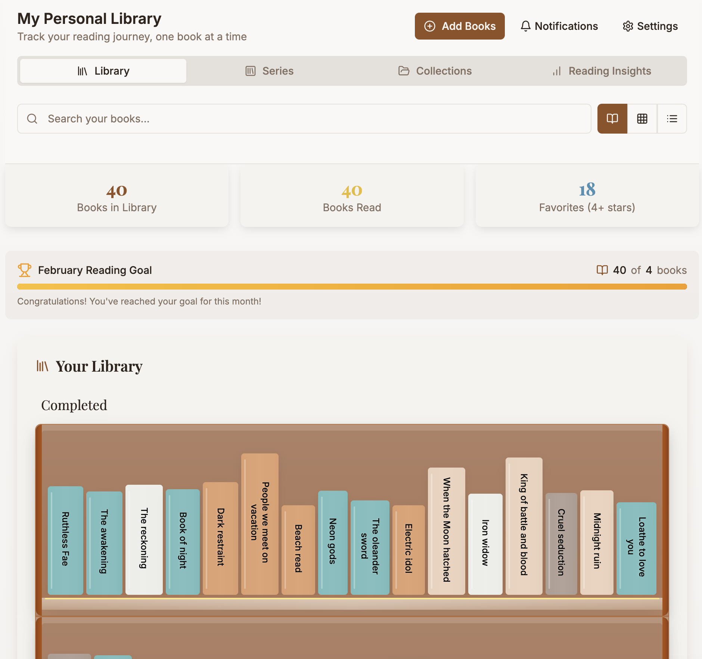

# Book Collection App

A personal library manager built for readers who want a simple, private way to track their reading. No accounts, no subscriptions, no tracking — just you and your books.

**[Try it live](https://book-collection-app-blue.vercel.app/)**



## The Story

This app was born from a friend's dream. They described their perfect book tracking app:

- Type in a book or author and have an API auto-fill basic info (title, author, genre, etc.)
- Fill out custom fields like completed date, rating, short notes, series info, and when the next book is expected
- A searchable, filterable list of all added books — like Excel, but with an API connection
- A virtual bookshelf where every book you add shows up as a spine with randomized colors that fit a color scheme, so you can scroll through and see all the books you've read

So that's exactly what we built.

## Features

### Library & Book Management
- Three view modes: bookshelf, list, and cover grid
- Search and add books via **Google Books API** or **Open Library API**
- Automatic fallback between API providers if one is unavailable
- Manual book entry for books not found online
- Edit book details including title, author, genre, page count, and description
- Reading status tracking: To Read, Reading, and Completed
- Star ratings and personal notes
- Book cover images from API or custom uploads
- Advanced search with fuzzy matching across all fields
- Sort and filter books by status, genre, author, and more

### Series
- Dedicated Series page to organize books into series
- Series auto-detection from Google Books and Open Library metadata
- Manual series creation and book assignment
- Series detail view with reading order tracking
- Filter series by genre, author, and reading status

### Collections
- Create custom collections to group books however you like
- Assign books to multiple collections
- Collection detail view with book list
- Custom colors and descriptions for each collection
- Collections are preserved when deleting your library

### Reading Insights
- Dedicated Insights page with reading statistics and visualizations
- Reading goal tracker with monthly progress
- Books completed over time

### Import & Export
- Import books from CSV files (supports YYYY-MM-DD and MM/DD/YYYY date formats)
- Import books from JSON files with full metadata
- Enhanced backup format preserving books, series, and collections
- Restore from backup with automatic series and collection reconstruction
- Import and export available from every page via Settings
- **JSON is the recommended format** for full data preservation

### API Providers
- **Google Books API** — search, metadata, and cover images
- **Open Library API** — search, metadata, cover images, and series detection
- Configurable default provider in Settings
- Built-in rate limiting, retry logic, and response caching
- Automatic provider fallback if the active provider is unavailable

### Personalization
- Dark and light theme support
- Personalized library name
- Configurable default view mode
- Birthday celebration feature
- Unified Settings modal accessible from all pages

### Privacy
- All data stored locally in your browser using IndexedDB
- No data sent to any server — only search queries go to Google Books / Open Library
- No account required
- Export your data anytime, delete it anytime

## Tech Stack

- **React 18** with **TypeScript 5**
- **Vite** for builds and hot module replacement
- **Tailwind CSS** with custom animations
- **shadcn/ui** (Radix UI) component library
- **Lucide React** icons
- **IndexedDB** for client-side persistence
- **React Context API** for state management

## Getting Started

### Prerequisites

- Node.js 16.x or higher
- npm 8.x or higher

### Installation

```bash
git clone https://github.com/LaMia-3/book-collection-app.git
cd book-collection-app

npm install
```

### Running

```bash
npm run dev
```

The app will be available at `http://localhost:8094`.

## Project Structure

```
src/
├── components/       # React components and UI
│   ├── layout/       # App layout and navigation
│   ├── navigation/   # Header and nav components
│   ├── series/       # Series-specific components
│   ├── filters/      # Filter panels
│   ├── dialogs/      # Dialog components
│   ├── debug/        # Dev/debug utilities
│   └── ui/           # shadcn/ui primitives
├── pages/            # Route pages
├── hooks/            # Custom React hooks
├── services/         # API clients and data services
│   ├── api/          # Book API providers (Google, Open Library)
│   └── storage/      # IndexedDB storage service
├── repositories/     # Data access layer
├── contexts/         # React context providers
├── types/            # TypeScript type definitions
└── utils/            # Utility functions (import, export, backup)
```

## Routes

- `/` — Main bookshelf
- `/series` — Series management
- `/series/:seriesId` — Series detail
- `/collections` — Collections
- `/collections/:collectionId` — Collection detail
- `/insights` — Reading insights and goals
- `/about` — Changelog, known issues, roadmap, privacy, and about
- `/admin` — Admin tools and debugging

## Contributing

Contributions are welcome! Please feel free to submit a Pull Request.

1. Fork the repository
2. Create your feature branch (`git checkout -b feature/amazing-feature`)
3. Commit your changes (`git commit -m 'Add some amazing feature'`)
4. Push to the branch (`git push origin feature/amazing-feature`)
5. Open a Pull Request

---

Made with ❤️ because a friend had a dream, and I had the code.